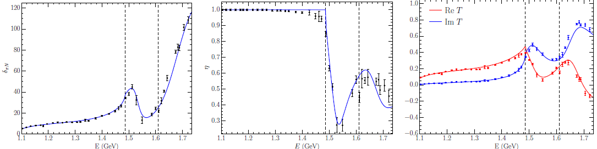

# HEFT Code
This file is intended to provide an overview of how I would use this code to perform a typical HEFT analysis.
I will provide a brief overview of my typical workflow, with more detail provided for each step afterwards.

## Folder Structure
The folder `src` contains all of todo

# Work Flow
1. Run `newProject.py` to easily set up all the config files, and skip to step 4.
To do the initial setup manually, go to step 2.
2. Make a folder for the new project, and link the makefile from `heftCode/makefile` in this folder.
3. Enter the details of the system into `HEFT.config`.
4. Set up an initial guess for the fit parameters in `allFits.params`.
   If I'm trying to replicate the results of a paper, I will then get the fit parameters from that paper and put them into `allFits.params`, then skip to step TODO.
5. Get some scattering data to fit to, generally the WI08 solution from [SAID](https://gwdac.phys.gwu.edu/).
   This should be in a file called `dataInf.in` (see the example in this folder)
6. Setup `HEFTFitting.config` with the bounds on each category of fit parameter, and which parameters will be active in the fitting process.
7. If I want to run a bounded fit, make and run `fitBQ.x`.
   This program uses Powell's BOBYQA algorithm to minimise a $\chi^2$ between the HEFT phase shift and inelasticity, and the scattering data.
   If I don't want to use bounds, make and run `fit.x`, which uses minfun (Powell's NEWUOA algorithm).
8. Make sure `HEFTInfinite.config` is correct, with the correct energy range.
9. Set `iParamChoice` in `allFits.params` to the new parameter set found by the fit procedure, then make and run `inf.x` to calculate the scattering observables for this parameter set.
   I usually plot these using a file called `PhasevE.py`, which is copied from another project I've worked on.
10. To search for pole positions, you can make and run `poles.x`.
	This does a grid search from $ 1.0 - 0.01i $ to around $ 2.0 - 0.2i $ GeV, and should pick up the positions of any poles in the $ T $-matrix.
11. In a finite-volume, we're typically interested in how the eigenvalues and eigenvectors of the finite Hamiltonian vary with $m_{\pi}^{2}$.
	Finite-volume config options such as the $m_{\pi}^2$ range to be calculated are found in `HEFTFinite.config`.
12. To find the slope of the bare mass(es), I need lattice data to fit to.
	I store this in a file called `slopeFitMasses.data`.
13. To fit the bare mass slope(s), I make and run `fitBare.x`.
	The config file `HEFTFinite.config` contains the guess for the bare slope, and the order of the bare mass extrapolation.
14. To calculate the finite-volume energy spectrum, there are two options.
	The usual case is that the lattice size $L$ is varying with $m_{\pi}^{2}$, so I run `lqcdFin.x`.
	If I want to keep $L$ constant and just vary $m_{\pi}^{2}$, I run `mpiFin.x`.
15. To plot the spectrum, I have a plot script called `EvMpi.py`.
	Typically I'll have a few of these for different sets of lattice data, such as in the odd-parity nucleon case where I have `EvMpi_3fm.py`, `EvMpi_2fm.py`, and `EvMpi_D200.py`.
16. To plot the eigenvectors, I have a script called `EvecvMpi.py`.
17. **Extra:** There are also a few other things I might be interested in, such as comparing multiple parameter sets, such as in the $\Delta(1232)$ regularisation and multiple bare state papers.
  I can search for poles with a varying set of parameters with `multiFitPoles.x`.
  I calculate the finite-volume spectrum for a varying set of parameters with `multiFitFin.x`.

## 1. newProject.py
todo

## 3. HEFT.config
I had the general goal over my PhD of being able to do an entire new HEFT study having to change as little as possible in the actual code.
This goal was achieved to some degree, where a majority of the configuration specific to a system is stored in a file called `HEFT.config`.
An example of this file for the $S_{11}$ 2b3c (odd-parity nucleons) system is shown here.

**HEFT.config for $S_{11}$ 2b3c:**
```
 1  # NStar_2b3c config
 2
 3  n_channels   3
 4  n_bare       2
 5
 6  # Channel                   partialWave
 7  pion          Nucleon       S
 8  eta           Nucleon       S
 9  Kaon          Lambda        S
10
11  OnshellChannel    1
12  useCustomMasses   F
13  particles_3fm.in
14
15  # Bare state labels
16  N1
17  N2
18
19  # g (2-1 potential), v (2-2),   u (regulator)
20  B                    B          A
```
1.
    Lines 3 and 4 simply denote how many two-particle channels are present, and how many bare basis states are present in the system.
2.
    Lines 7 through 8 describe each two-particle channel in the system.
    The details of each hadron are stored in `heftCode/particles.in}, such as the mass, and the mass slope (how it varies in $m_{\pi}^{2}$).
    The partial wave label tells the program which partial wave the channel is interacting in, and is used for things such as choosing whether to start at $k=0$ or $k=1$ in a finite-volume, or having factors of $k^{l}$ for angular momentum $l$ in the potentials.
3.
    Line 11 tells the program which of those channel is on-shell in the scattering process (starting from 1).
    Generally this is going to be the $ \pi N $ channel, though in the $\Lambda^{*}(1405)$ case it would be a $\bar{K}N$ channel.
4.
    Lines 12 and 13 tell the program which file to use for the particle masses.
    By default, it uses `heftCode/particles.in`.
    When I'm doing a finite-volume study where I want to have slightly larger masses at the physical point, I set `useCustomMasses` to `T`, and give the file name of the new particles file to use.
5.
    Lines 16 and 17 are just the labels I give to each bare state, which is helpful for printing/writing data to files.
6.
    Line 20 is where I set which potential is used for each interaction.
    There are three customisation options here, which describe the functions used for $G_{\alpha}^{B_{0}}(k)$, $V_{\alpha\beta}(k,k')$, and the regulator $u(k,\Lambda)$.
    The labels `A`, `B`, etc. correspond to functions in `heftCode/heft.f90`, with names such as `u_k_A`, `g_k_B`, and `f_k_A`.
    Note that `f_k` represents the separable part of $V_{\alpha\beta}(k,k') = v_{\alpha\beta}\, f_{\alpha}(k)\, f_{\beta}(k')$.


## 4. allFits.params
With the general properties of the system of interest set out in \ttt{HEFT.config}, we're able to generate the file which will contain all of the parameter sets for the system.
These parameters are the bare mass(es) $m_{B_{0}}^{(0)}$, the couplings between bare basis states and two-particle basis states (2-1 couplings) $g_{\alpha}^{B_{0}}$, the regulator parameters for 2-1 interactions $\Lambda_{\alpha}^{B_{0}}$, the couplings between two-particle basis states (2-2 couplings) $v_{\alpha\beta}$, and the regulator parameters for 2-2 interactions $\Lambda_{v,\alpha}$.

**allFits.params for $P_{33}$ 1b1c:**
```
1      nParam        5
2      iChoice       1
3      paramEnds  1 2 3 4 5
4      n    m_bare   g_Delta   Lambda    v_piN     Lambda_v     chi2    Notes
5      1    1.4000   0.10000   0.8000   -0.10000   0.8000        0.00   Default
6      2    1.3588   0.17615   0.8000   -0.02863   0.8000      236.81   AAA
7      3    1.4073   0.00000   0.8000   -0.00290   8.0000    24373.49   AAA
8      4    1.3850   0.14057   0.8000   -0.03066   0.8000      244.65   AAB
9      0    0.0000   0.00000   0.0000    0.00000   0.0000        0.00
```

-
  `nParam` refers to the total number of parameters.
  For $n_{b}$ bare basis states, and $n_{c}$ scattering channels, considering all five categories of fit parameters gives

   $n_{\text{param}} = n_{b} + n_{b} n_{c} + n_{b} n_{c} + \frac{1}{2} n_{c}(n_{c}+1) + n_{c} = n_{b} + 2 n_{b} n_{c} + \frac{1}{2} n_{c}(n_{c}+1) + n_{c}$

-
  `iChoice` chooses which parameter set to use (given by the `n` column)
-
  `paramEnds` denotes which column each parameter category ends on.
  This is trivial for the 1b1c case, but for the 2b3c case (see `allFits_N2b3c.params`) this would be `2  8  14  20  23`.
  This refers to $m_{B_{0}}^{(0)}$ ending on column 2, $g_{\alpha}^{B_{0}}$ ending on column 8, $\Lambda_{\alpha}^{B_{0}}$ ending on column 14 etc.
-
  For lines 5 through 8, each of the numbered rows are a parameter set, with parameters in the order $m_{B_{0}}^{(0)}$, $g_{\alpha}^{B_{0}}$, $\Lambda_{\alpha}^{B_{0}}$, $v_{\alpha\beta}$, $\Lambda_{v, \alpha}$.
  Following this is the $\chi^{2}$ for the fit, then any notes about the fit I've added.
  Usually this is just which set of potentials and regulators that fit corresponds with.
-
  The last row is always just a row of zeros, which makes it each to detect the end of file when reading/writing.
  As an example the third `A` corresponds with a dipole regulator, while a `B` in that spot would be a Guassian regulator.
  Note that these are just a note for myself, and do not set what the program uses.
  The actual set of potentials/regulators are set in `HEFT.config`.

If we are attempting to reproduce a previous study, we'll want to insert the parameters from that study into this file, such as the set shown here on line 6.
We can then skip to Step todo.

## 5. Scattering Data
The first thing we need to perform a fit is some scattering data to fit to. Typically, we’ll get this from the SAID Partial Wave
Analysis [website](https://gwdac.phys.gwu.edu/). This website sometimes has some issues since it’s fairly old, so you may need to try a different browser/OS
if a link isn’t working, or if the data isn’t displaying properly.
1. In order to obtain a particular set of $\pi N$ scattering data, on the left-hand side of the website, follow the [Pion-Nucleon](https://gwdac.phys.gwu.edu/analysis/pin_analysis.html)
link, and then click Partial-Wave Amplitudes.
2. Here, we’ll want to use the **WI08** solution for both options, which is the most up-to-date data set.
3. I prefer to use Wcm as the energy variable (centre-of-mass energy), which is the convention we’ve used for any recent
publications. Older papers tend to use **Tlab** (the kinetic energy of the pion).
4. For the lower bound in the centre-of-mass frame, we’ll want to use the rest mass of the pion-nucleon system. I don’t
believe they have any data below 1080 MeV, so that should be a perfectly fine number to put in here. The increment is
less important since I prefer to use the single-energy solution for fitting, but 10 MeV should be fine here.
5. The upper bound will depend on the study. At minimum, you’ll want it to be the mass of the resonance(s) you’re
considering, plus at least half the width of the resonance. This is the minimum to capture the features of the resonance,
though in practice you may want to go slightly higher. You’ll also want to consider the energies which any channels
open up that you’re not interested in, and the masses of excited states in the spectrum which you don’t want to study.
As a couple of examples, in the 1b1c $\Delta(1232)$ study, we stop at 1350 MeV, since this is approximately where the $\pi\Delta$
channel opens. In the 2b3c $S_{11}$ study, we stopped at 1750 MeV, since that is enough to encapsulate the $N^{\ast}(1650)$
which has a width of approximately 125 MeV, without including too many effects from the $N^{\ast}(1895)$.
6. Finally, you’ll want to select the partial wave of interest.

## 6. HEFTFitting.config
Using the scattering data, we can now attempt to perform a fit by first setting up the `HEFTFitting.config` file. Here is
an example file for a system with two bare states and a single channel.

**HEFTFitting.config for $P_{33}$ 2b1c:**
```
 1  #      Bounds                  Errors
 2  m1     1.2         1.8         1e-5
 3  m2     1.2         1.8         1e-5
 4  g      0.00001     1.0	       1e-4
 5  Lam    0.6         1.2	       1e-5
 6  v     -1.0        -0.00001     1e-4
 7  Lamv   0.6         1.2	       1e-5
 8
 9  # Which parameters are active
10  # m_b1      m_b2      g_b1c1    g_b2c1    Lam_b1c1  Lam_b2c1   v_c1c1    Lam_v_c1
11    T         T         T         T         F         F          T         F
12
13    T         T         T         T         T         T          T         T
14    F         T         F         T         F         T          F         F
```

- Lines 2 – 7 control the bounds of the parameter search. Currently I have it setup so that the bounds can be individually
set for each bare mass, and set collectively for each of the other types of parameter: $g_{\alpha}^{B_{0}}$, $\Lambda_{\alpha}^{B_{0}}$, $v_{\alpha\beta}$, $\Lambda_{v,\alpha\beta}$-
I found that being able to set the bounds for each individual parameter was pretty tedious when I wanted to alter them
for studies with a lot of parameters, such as the 2b3c odd-parity nucleons which had 23 or so parameters.
The errors column is currently only used in the old fitting code (`fitScattering.f90`), which allowed for error
requirements for individual parameters. The newer version (`fitScattering_bobyqa.f90`) instead normalises all
parameters, and uses a varying error requirement (trust regions) to hone in on the smallest viable error. I ended up
hard-coding the amount the trust region shrinks by in `fitScattering_bobyqa.f90`, since it doesn’t really need
to be changed from my experience.
I used to manually scale the parameters to include bounds since Powell’s old fitting code (`minf.f90`) didn’t allow for
bounded fits (BOBYQA does). That’s why some of the bounds are set to numbers like 0.0001 instead of 0.0, since my
scaling implementation didn’t allow for a bound of zero.
- Line 11 dictates which parameters are free during the fitting process. Here, I’m using a `T` (True) to denote that the
parameter is varied during fitting, and a `F` (False) to say that the parameter is held fixed. So in this example, I’m
varying the bare mass and the couplings, but holding the regulator parameters ($\Lambda$) fixed.
If a parameter is held fixed, it’ll use the value of whichever parameter set `allFits.params` is currently using.
- The fitting code (`fitScattering_bobyqa.f90`) doesn’t read anything after the previous line. As a result I tend to
use the space afterwards to store alternative sets of which parameters are fixed, so I can quickly switch between them.

## Constraining the Fit Parameters
The fitting code I always use now is `fitScattering_bobyqa.f90` (which compiles to `fitBQ.x`). Since this has a
proper implementation of a bounded parameter search, it is much faster and less likely to get stuck in local minima than the
old `fitScattering.f90`. In saying that, it is still very easy for the fitting algorithm to get stuck in local minima, so a
decent chuck of the difficulty in finding a good fit to the scattering data is finding the right initial position (parameter set).

There are a couple of ways to do this. The easiest, and the first way is to use a fit to a similar system as a starting point.
As an example, when I did the 2b3c odd-parity analysis, I started with the 1b2c parameter set from [arXiv:1512.00140](https://arxiv.org/abs/1512.00140). This
initial guess didn’t end up being the one that gave me the fit I ended up with, but I still think this is a good place to start in
general.

What ended up being the most useful for me however was just brute force searching for a good initial guess. I once
attempted to train a neural net to give an initial guess, and in the process I wrote `trainingInfiniteVol.f90` to
generate the training data. This program just randomly guesses parameter sets and calculates the $\chi^{2}$ for them. The neural net
didn’t end up working any better than just picking the best parameter set from the training data, but this program ended up
being a decent way to get a few good initial guesses by just grabbing the few parameter sets which have the lowest $\chi^{2}$ from
it. It also uses coarrays to run in parallel, so it doesn’t take too long to let it run over a few million parameter sets and pick
the best ones as initial guesses for the actual fitting routine.


To actually perform the fit, all that is necessary is to set the initial guess in `allFits.params`, and then run `fitBQ.x`.
When this is finished, currently it prompts the user to save the fit to `allFits.params`. It’ll give a preview of the parameter
set and $\chi^2$, so if the program got lost in a local minima and ended up garbage this is an easy way to discard the fit.

The time taken for the program to run scales pretty heavily with the number of parameters, so its a good idea to think
about which parameters can be fixed or set to zero. As an example, you might have a decent idea of what the bare mass
should be, either from the quark model or lattice QCD, so you could try manually setting and fixing the bare mass and letting
the other parameters run. You could then do a second fit on this, where you allow the bare mass and other parameters to only
vary within small bounds, to refine the fit. Its also worth thinking about which couplings can be set to zero and fixed. As
an example, in the 2b3c odd-parity analysis I set the coupling $g_{K\Lambda}^{N_{1}}$ to zero, since the $K\Lambda$ threshold is fairly far above the
$N^{\ast}(1535)$, and shouldn’t have any significant contribution to it. Finally, its also sometimes useful to try fixing the regulator
parameters ($\Lambda$). While the additional degrees of freedom can be useful for the fitting, to speed up the fit it might be worth
fixing them to a phenomenologically motivated value.

## 8. HEFTInfinite.config
Having obtained a fit, which should have been inserted into `allFits.params`, we can calculate infinite-volume quantities.
The config file for this is:

**HEFTInfinite.config for $S_{11}$ 2b3c:**
```
1  # Config file for infinite volume HEFT
2
3  # Scattering observables calculation (infiniteVol.f90)
4  E_init          1.1
5  E_final         1.735
6  nPoints         256
7  useDataPoints   False
```

This config file is pretty minimal, and mostly is just setting up the output for plotting. If `useDataPoints` on line 7
is set to `True`, it’ll ignore the other settings and set the energy range and number of points based on the scattering data in
`dataInf.in`. Otherwise, you can manually set which energy range you want to calculate the scattering quantities, and how
many points to calculate. Usually I’ll leave `useDataPoints` to True so I can see how the fit compares to the data, and
then set it to False and increase the number of points to make a nice smooth curve for the showing off the plot.

## 9. Infinite-Volume Calculations
The code for calculating the scattering quantities is found in `infiniteVol.f90`, and compiles to `inf.x`. The parameter
set which one wishes to use should be set in `allFits.params`. This program solves the scattering equation over a variety
of energies as set in `HEFTInfinite.config`, and outputs the phase shifts, the inelasticity, and the $T$-matrix values for
each energy. These are outputted to scattering `fitX.out` and `tmatrix_fitX.out` in the data folder, where the `X`
will be set to number of the parameter set used in `allFits.params`.

To plot these quantities, I have analysis-specific plotting scripts in each project folder. `PhasevsE.py` will plot the phase
shift vs energy, and the inelasticity vs energy if there is more than one channel in the analysis. Similarly `TmatvsE.py` will
plot the $T$-matrix values. These will have to be edited a bit for each project, though they are written to be as automatic and
general as possible (should automatically have the channel thresholds plotted for example). Example outputs of these scripts
for the 2b3c $S_{11}$ system are shown in Fig. 1, where from left from right we have the comparison of the HEFT values
(solid lines) with the scattering data (data points) for the $\pi N$ phase shift, inelasticity, and $T$-matrix values.




## 10. Pole Positions


## 11. HEFTFinite.config


## 13. Fitting the Bare Mass Slopes


## 14. Finite-Volume Energy Spectrum


## Other Files

### heft.f90
All code in this project has `heft.f90` as a dependency. This file contains all global variables required for a HEFT study,
such as the bare masses, couplings, and potentials.
